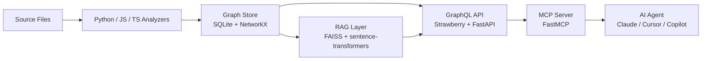

# codegraph

[](https://github.com/agamgupta/codegraph/actions)
[](https://www.python.org/downloads/)
[](LICENSE)

**Give AI agents a graph view of your codebase. Stop wasting context on exploration.**

---

## The Problem

When an AI agent (Claude Code, Cursor, Copilot) starts working on a codebase, it wastes 50-80% of its context window on exploration: grepping for files, reading imports, tracing call chains, re-reading the same modules. Every session starts from zero.

**Before codegraph** — agent burns 8,000 tokens reading 20 files to understand one function:
```
read auth.py → read models.py → read utils.py → grep for callers → read api.py → ...
```

**After codegraph** — agent asks one question, gets exactly what it needs in ~200 tokens:
```graphql
{
  contextFor(qualifiedName: "auth.authenticate", depth: 2) {
    summary
    relatedNodes { name nodeType filePath }
    edges { edgeType sourceId targetId }
  }
}
```

---

## Quick Start

```bash
pip install codegraph

# 1. Index your codebase
codegraph index /path/to/your/repo

# 2. Start the server (GraphQL + MCP)
codegraph serve

# 3. Connect Claude Desktop via MCP (see examples/mcp_config.json)
```

---

## Killer GraphQL Queries

**Find a function and all its callers — before you refactor:**
```graphql
{
  function(name: "authenticate") {
    name
    qualifiedName
    filePath
    startLine
    signature
    docstring
    callers { name filePath startLine }
    callees { name filePath startLine }
  }
}
```

**Get a token-budgeted context subgraph — the main event:**
```graphql
{
  contextFor(qualifiedName: "myapp.auth.authenticate", depth: 2) {
    summary
    estimatedTokens
    centerNode { name nodeType }
    relatedNodes { name nodeType filePath signature }
    edges { sourceId targetId edgeType }
  }
}
```

**Semantic search over docs and docstrings:**
```graphql
{
  searchDocs(query: "how does session management work", limit: 5) {
    content
    source
    relevanceScore
  }
}
```

**Understand file coupling before a refactor:**
```graphql
{
  dependencies(filePath: "src/auth.py", depth: 2) { path language }
  dependents(filePath: "src/auth.py", depth: 1) { path }
}
```

---

## MCP Setup (Claude Desktop)

Add to `~/Library/Application Support/Claude/claude_desktop_config.json`:

```json
{
  "mcpServers": {
    "codegraph": {
      "command": "codegraph",
      "args": ["serve", "--mcp-stdio", "--repo", "/path/to/your/repo"],
      "env": {
        "CODEGRAPH_DATA_DIR": "/path/to/your/repo/.codegraph"
      }
    }
  }
}
```

Claude can now answer "what functions call `authenticate`?" without reading any files.

---

## MCP Tools

| Tool | Description |
|------|-------------|
| `find_function(name)` | Find a function: location, signature, callers, callees |
| `find_class(name)` | Find a class: methods, base classes, subclasses |
| `get_context(qualified_name, depth)` | **Token-budgeted subgraph** — everything needed to work on a symbol |
| `find_callers(qualified_name)` | Who calls this? Critical before refactoring |
| `find_callees(qualified_name)` | What does this call? Understand dependencies |
| `search_code(pattern, node_type)` | Substring search for functions/classes |
| `search_docs(query)` | Semantic search over docs and docstrings |
| `file_dependencies(file_path)` | What a file imports and what imports it |
| `codebase_stats()` | Overview: files, languages, node counts |
| `reindex()` | Incremental reindex (only changed files) |

---

## Architecture



---

## Supported Languages

| Language | Parser | Status |
|----------|--------|--------|
| Python | stdlib `ast` | ✅ Full support |
| JavaScript | tree-sitter | ✅ Full support |
| TypeScript | tree-sitter | ✅ Full support |
| Go | — | 🗺 Roadmap |
| Rust | — | 🗺 Roadmap |

---

## Configuration

All settings can be set via environment variables (prefix `CODEGRAPH_`) or a config file.

| Setting | Default | Description |
|---------|---------|-------------|
| `data_dir` | `./data` | Where to store the graph DB and FAISS index |
| `repo_path` | `None` | Path to the repo being indexed |
| `respect_gitignore` | `true` | Respect `.gitignore` patterns |
| `exclude_patterns` | `node_modules, __pycache__, .venv, dist` | Additional exclusions |
| `max_file_size_kb` | `500` | Skip files larger than this |
| `embedding_model` | `all-MiniLM-L6-v2` | Sentence transformer model for RAG |
| `chunk_size` | `500` | Doc chunk size in words |
| `graphql_port` | `8000` | GraphQL server port |
| `max_subgraph_tokens` | `4000` | Token cap for `contextFor` responses |

---

## Docker

```bash
REPO_PATH=/path/to/your/repo docker-compose up
```

GraphQL playground available at `http://localhost:8000/graphql`.

---

## Comparison with Alternatives

| Tool | For Humans | MCP | Graph-shaped | Agent-native |
|------|-----------|-----|-------------|-------------|
| **codegraph** | ✅ | ✅ | ✅ | ✅ |
| tree-sitter | ✅ | ❌ | ❌ | ❌ |
| Sourcegraph | ✅ | ❌ | ✅ | ❌ |
| LSP | ✅ | ❌ | ❌ | ❌ |
| ctags | ✅ | ❌ | ❌ | ❌ |

codegraph is the only tool designed from day one for LLM consumption — clean structure, token-conscious output, MCP-native.

---

## Roadmap

- [ ] Go support (via tree-sitter-go)
- [ ] Rust support
- [ ] Symbol rename tracking
- [ ] Call graph visualization (Mermaid output)
- [ ] GitHub Actions integration
- [ ] Cross-repo graph federation
- [ ] Live LSP integration for real-time updates

---

## Author

**Agam Gupta** — built codegraph to stop AI agents from burning context on exploration.

---

*codegraph is MIT licensed. Contributions welcome.*
