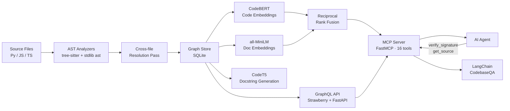

# codegraph

[](https://github.com/agamgupta/codegraph/actions)
[](https://www.python.org/downloads/)
[](LICENSE)

**Stop AI agents from hallucinating about your code. Give them structured ground truth instead.**

---

## The Problem

AI agents have two failure modes when working with code:

**1. Hallucination** — the agent recalls a function signature, import path, or class hierarchy from training data or fuzzy memory. It's wrong. The code breaks. The developer has to debug something the agent invented.

**2. Token waste** — to avoid hallucinating, the agent reads files. All of them. A typical session burns 50-80% of the context window on exploration before writing a single line. That leaves little room for actual reasoning.

These aren't separate problems. They're the same problem: the agent lacks **precise, structured, on-demand access to ground truth**.

codegraph solves both.

---

## How It Works

codegraph indexes your codebase into a **persistent graph** (files → modules → classes → functions → calls → imports) backed by SQLite, then exposes it through a **GraphQL API** and an **MCP server** with 16 tools.

When an agent needs to understand `authenticate()`:

**Before codegraph** — reads 4 files, burns ~3,200 tokens, may still get the signature wrong:
```
read auth.py (800 tokens) → read models.py (600 tokens) → read utils.py (400 tokens)
→ grep for callers → read api.py (900 tokens) → maybe hallucinate the return type anyway
```

**With codegraph** — one query, ~180 tokens, AST-verified:
```graphql
{
  function(name: "authenticate") {
    signature       # "(username: str, password: str, users: dict) -> Optional[Session]"
    docstring       # exact, from AST
    callers { name filePath startLine }
    callees { name filePath }
  }
}
```

The signature came from the AST parser. It cannot be wrong.

---

## Token Savings — Real Numbers

The `token_savings_estimate` tool measures this per-symbol:

```json
{
  "symbol": "auth.authenticate",
  "naive_approach_tokens": 3240,
  "codegraph_tokens": 180,
  "tokens_saved": 3060,
  "savings_percent": 94,
  "explanation": "Reading auth.py + imports naively costs ~3240 tokens. Querying codegraph costs ~180. That's 94% fewer tokens — more context for actual reasoning."
}
```

The freed context isn't wasted — it's available for the agent to reason deeper, hold more of the task in memory, and produce better output.

---

## Quick Start

```bash
pip install codegraph

# Index your codebase (Python, JS, TS)
codegraph index /path/to/repo

# Start the GraphQL server
codegraph serve

# Or start the MCP server for Claude Desktop
codegraph serve --mcp-stdio
```

---

## Anti-Hallucination Tools

These tools exist specifically to give agents verified facts instead of recalled guesses:

### `get_source` — exact implementation, not agent memory
```python
get_source("auth.authenticate")
# Returns exact source lines from the file, with provenance: "ast_parsed"
# Use instead of: "I think this function does X..."
```

### `verify_signature` — fact-check before citing
```python
verify_signature("auth.authenticate", "(username, password)")
# → { "match": false, "actual": "(username: str, password: str, users: dict) -> Optional[Session]",
#     "verdict": "WRONG — use the actual signature above" }
```

### `impact_analysis` — know what breaks before touching anything
```python
impact_analysis("auth.authenticate")
# → { "risk_level": "high", "immediate_callers": [...], "transitive_callers": [...],
#     "summary": "authenticate is called by 3 functions directly and 8 more transitively..." }
```

---

## All MCP Tools

| Tool | Purpose |
|------|---------|
| `get_source(name)` | **Ground truth source** — exact lines from file, AST-verified |
| `verify_signature(name, claimed)` | **Anti-hallucination** — confirm a signature before using it |
| `token_savings_estimate(name)` | **Measure** how many tokens you save vs reading files |
| `find_function(name)` | Location, signature, callers, callees |
| `find_class(name)` | Methods, base classes, subclasses |
| `get_context(name, depth)` | Token-budgeted subgraph, ranked by fan-in importance |
| `impact_analysis(name)` | What breaks if this changes? Risk scoring |
| `find_dead_code()` | Unreachable functions — candidates for deletion |
| `get_diagram(name)` | Mermaid call graph to embed in docs or PRs |
| `find_callers(name)` | Who calls this? Full transitive chain |
| `find_callees(name)` | What does this call? |
| `search_code(pattern)` | Substring search across functions/classes |
| `search_docs(query)` | Hybrid BM25 + vector search over docs and docstrings |
| `file_dependencies(path)` | Import graph for a file |
| `codebase_stats()` | Overview: languages, counts, last indexed |
| `reindex()` | Incremental reindex (only changed files) |

---

## Killer GraphQL Queries

**Ground truth signature — never hallucinate a function call again:**
```graphql
{
  function(name: "authenticate") {
    signature
    docstring
    isAsync
    callers { name filePath startLine }
    callees { name filePath }
  }
}
```

**Full context before a change — token-budgeted, fan-in ranked:**
```graphql
{
  contextFor(qualifiedName: "auth.authenticate", depth: 2) {
    summary
    estimatedTokens
    mermaidDiagram
    relatedNodes { name nodeType signature }
    edges { sourceId targetId edgeType }
  }
}
```

**Impact analysis — required reading before any refactor:**
```graphql
{
  impactOf(qualifiedName: "auth.authenticate") {
    riskLevel
    summary
    immediateCallers { name filePath startLine }
    transitiveCallers { name qualifiedName }
    affectedFiles
  }
}
```

**Dead code sweep:**
```graphql
{ deadCode { name qualifiedName filePath startLine } }
```

---

## MCP Setup (Claude Desktop)

```json
{
  "mcpServers": {
    "codegraph": {
      "command": "codegraph",
      "args": ["serve", "--mcp-stdio", "--repo", "/path/to/your/repo"],
      "env": {
        "CODEGRAPH_DATA_DIR": "/path/to/your/repo/.codegraph"
      }
    }
  }
}
```

---

## Architecture



**Key design decisions:**
- **AST-first, not heuristic** — signatures and call edges come from the parser, not regex
- **Cross-file resolution pass** — after indexing, call edges are linked across file boundaries into a connected graph
- **Fan-in ranking** — `contextFor` fits nodes within token budget sorted by how often each is called; most critical code surfaces first
- **Hybrid search** — BM25 keyword + FAISS vector similarity merged with Reciprocal Rank Fusion (RRF); neither alone is sufficient
- **Provenance tagging** — every `get_source` response includes `"provenance": "ast_parsed"` so agents can distinguish verified facts from recalled ones

---

## Supported Languages

| Language | Parser | Status |
|----------|--------|--------|
| Python | stdlib `ast` | ✅ Full |
| JavaScript | tree-sitter | ✅ Full |
| TypeScript | tree-sitter | ✅ Full |
| Go | — | 🗺 Roadmap |
| Rust | — | 🗺 Roadmap |

---

## Configuration

Set via environment variables (prefix `CODEGRAPH_`) or directly.

| Setting | Default | Description |
|---------|---------|-------------|
| `data_dir` | `./data` | Graph DB and FAISS index location |
| `repo_path` | `None` | Repo to index |
| `respect_gitignore` | `true` | Honour `.gitignore` |
| `exclude_patterns` | `node_modules, __pycache__, .venv, dist` | Additional exclusions |
| `max_file_size_kb` | `500` | Skip files above this size |
| `embedding_model` | `all-MiniLM-L6-v2` | Sentence transformer model |
| `chunk_size` | `500` | Doc chunk size in words |
| `graphql_port` | `8000` | GraphQL server port |
| `max_subgraph_tokens` | `4000` | Token cap for `contextFor` |

---

## Docker

```bash
REPO_PATH=/path/to/your/repo docker-compose up
```

GraphQL playground at `http://localhost:8000/graphql`.

---

## HuggingFace Integration

codegraph uses two specialised HuggingFace models, each where it does best:

### Code-aware embeddings (CodeBERT)
General text models embed `"def authenticate(user, pw)"` and `"iterate over items"` similarly because they share grammatical structure. **CodeBERT** (`microsoft/codebert-base`) was trained on 6 million code/docstring pairs — it understands that `hash_password` and `bcrypt.hashpw` are semantically the same operation.

codegraph uses a **dual-model strategy**:
- Code symbols (functions, classes) → `CodeBERT` embeddings — better semantic search against source code
- Documentation (README, `/docs`, docstrings) → `all-MiniLM-L6-v2` — optimised for prose similarity

Both indices are queried at search time and merged via Reciprocal Rank Fusion.

### Auto-docstring generation (CodeT5)
```bash
# After indexing, generate docstrings for all undocumented functions
codegraph enrich --data-dir ./data
# → Generated: 23  Skipped: 41 (already documented)  Failed: 0
```

Uses `Salesforce/codet5-base-codexglue-sum-python` to generate a one-line summary for every function with no docstring. Stored under `metadata.generated_docstring` — always distinct from AST-extracted docstrings so provenance is clear.

```python
node.docstring            # "Authenticate a user..." — from AST (ground truth)
node.metadata["generated_docstring"]     # "Verifies credentials and returns session." — CodeT5
node.metadata["docstring_provenance"]    # "codet5_generated"
```

---

## LangChain Integration

codegraph exposes a `CodeGraphRetriever` and a `CodebaseQA` chain that plug into any LangChain pipeline.

### CodebaseQA — chat with your codebase
```python
from codegraph.langchain import build_codebase_qa
from langchain_anthropic import ChatAnthropic

qa = build_codebase_qa(store, rag_retriever, llm=ChatAnthropic(model="claude-sonnet-4-6"))

result = qa.ask("What would break if I changed the User model?")
# → answer: "3 functions directly depend on User: authenticate() (auth.py:14),
#            login() (api.py:8), register_user() (api.py:31). Medium risk."
# → sources: ["auth.py", "api.py", "models.py"]
```

Every answer is grounded in the codegraph knowledge base — the LLM cannot hallucinate function signatures, file paths, or call relationships because the retriever supplies verified facts.

### CodeGraphRetriever — use codegraph in any LangChain chain
```python
from codegraph.langchain import CodeGraphRetriever

retriever = CodeGraphRetriever(store=store, rag=rag_retriever, k=5)

# Works with any LangChain chain
docs = retriever.invoke("how does session management work?")
# Each Document has metadata: source, result_kind, start_line, qualified_name
```

### Install LangChain extras
```bash
pip install "codegraph[langchain]"
# Installs: langchain, langchain-community, langchain-anthropic, langchain-huggingface
```

---

## Comparison with Alternatives

This is an active space. Other tools tackle overlapping problems:

| Tool | Approach | MCP | Impact Analysis | Anti-hallucination | Code Embeddings | LangChain |
|------|----------|-----|----------------|-------------------|-----------------|-----------|
| **codegraph** | AST graph + dual HF models | ✅ | ✅ | ✅ | ✅ CodeBERT | ✅ |
| codebase-memory-mcp | Graph DB + tree-sitter | ✅ | ❌ | ❌ | ❌ | ❌ |
| code-graph-mcp | AST knowledge graph | ✅ | ❌ | ❌ | ❌ | ❌ |
| codesight-mcp | tree-sitter, 34 tools | ✅ | ❌ | ❌ | ❌ | ❌ |
| repomix | File packing for LLMs | ✅ | ❌ | ❌ | ❌ | ❌ |
| Sourcegraph | Code search, human UI | ❌ | ❌ | ❌ | ❌ | ❌ |

The core difference: other tools help agents *navigate* code. codegraph also helps agents *trust* what they know about it.

---

## Roadmap

- [ ] Go support (tree-sitter-go)
- [ ] Rust support
- [ ] `watch` mode — live reindex on file save
- [ ] Cross-repo federation
- [ ] Confidence scores on extracted signatures
- [ ] VS Code extension

---

## Author

**Agam Gupta** — built codegraph to give AI agents accurate, structured code context so they spend tokens on reasoning instead of exploration, and produce answers grounded in facts instead of training-data memory.

---

*MIT licensed. Contributions welcome.*
